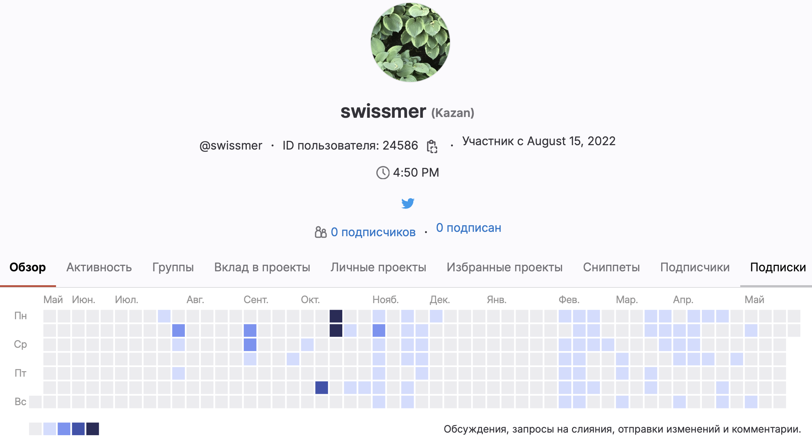

# Hello, World! 👋

✨ My name is **Daniil**. 

- I've been working as an iOS developer
- There is experience in team projects at school 21
- I write mobile applications using UIKit and SwiftUI

My activity on gitlab (school 21):

link: https://repos.21-school.ru/swissmer

#### Connect with me:

[][telegram]
[][post]

[telegram]: http://t.me/swissmer
[post]: mailto:daniil.ios.semyonov@yandex.ru
